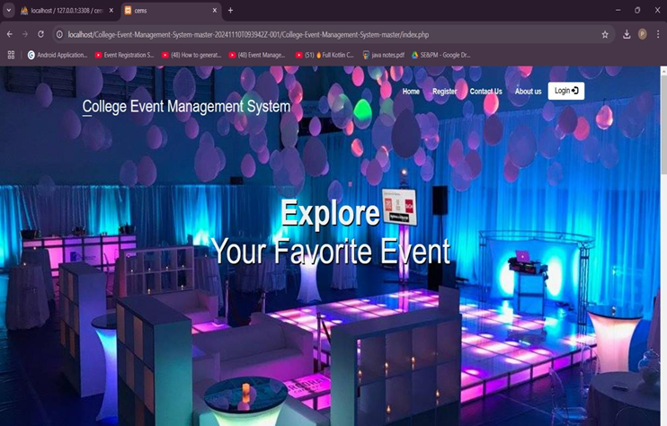

# 📋College-Event-Management-System
College Event Management System is a web-based application designed to streamline the planning, organization, and execution of college events. Built using PHP and MySQL, this system provides a centralized platform for administrators, staff coordinators, and student coordinators to efficiently manage event-related activities.

## Screenshots

## 🔑 Key Features

### Role-Based Access
- **Admin**: Manage all events, users, and system settings.
- **Staff Coordinator**: Assist in managing events and participants.
- **Student Coordinator**: Coordinate with participants and oversee student engagement.

### Event Management
- Create, update, view, and delete events.
- Register participants and manage event data.

### User Management
- Maintain staff and student details.
- Secure login system with role-based dashboards.

### QR Code Integration
- Generate QR codes for event tickets or attendance tracking.

### Database Integration
- Easily set up using the included `cems.sql` file.

## ⚙️ Technologies Used
- **Frontend**: HTML, CSS, JavaScript  
- **Backend**: PHP  
- **Database**: MySQL

## 🔐 Admin Login
- **Username**: `admin`  
- **Password**: `admin`
